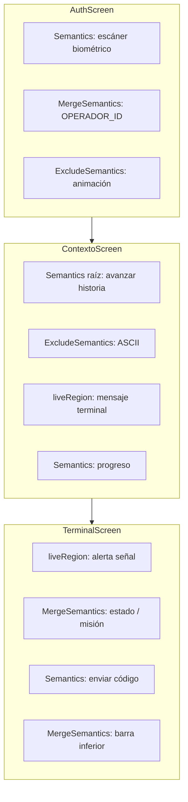

# ShadowNet

Aplicación Flutter de misión geolocalizada con estética de terminal encubierta. El tema visual se adapta al color dominante de las imágenes de equipo, y la interfaz está modelada con un árbol de **Semantics** pensado para lectores de pantalla y navegación por voz.

---

## Tema dinámico: de la imagen al `seedColor`

### Arquitectura

El color de la aplicación no está fijado en el diseño: se deriva del arte de cada operativo definido en `data/mision.json` (bloque `equipos`). La cadena es la siguiente:

```
mision.json → DinamiColorProvider → PaletteGenerator → themeColor → ColorScheme.fromSeed
```

`DinamiColorProvider` (`lib/providers/dinamiColor_provider.dart`) es un `ChangeNotifier` registrado en el árbol de `Provider` desde `main.dart`. Carga el JSON una sola vez, expone la lista de equipos y mantiene el color activo en `_themeColor`.

### Extracción con `palette_generator`

Cuando se invoca `getColor(int index)` con un índice válido del array `equipos`, el proveedor toma la URL o ruta de la imagen (`equipos[index]['image']`) y ejecuta `_extractDominantColor` de forma asíncrona:

1. **Entrada de imagen** — Se usa `PaletteGenerator.fromImageProvider` con un `NetworkImage` apuntando al recurso del equipo. La muestra se reduce a `Size(200, 200)` para acelerar el análisis sin perder la esencia cromática del asset.

2. **Selección del tono** — El paquete `palette_generator` descompone la imagen en una paleta Material Design (vibrant, muted, light/dark). El color semilla se elige con una cascada de prioridad que favorece tonos vivos y legibles en UI:

   | Orden | Swatch |
   |------:|--------|
   | 1 | `vibrantColor` |
   | 2 | `dominantColor` |
   | 3 | `lightVibrantColor` |
   | 4 | `darkVibrantColor` |
   | 5 | `lightMutedColor` |
   | 6 | `darkMutedColor` |
   | 7 | `Colors.blue` (reserva si la paleta viene vacía) |

3. **Resiliencia** — Si la descarga o el análisis fallan, se aplica `Colors.deepPurple` como color de contingencia. En ambos casos, `notifyListeners()` en el bloque `finally` propaga el cambio a los widgets suscritos.

4. **Valor inicial** — Antes de cualquier extracción, el tema arranca con un gris azulado fijo (`Color.fromARGB(221, 144, 160, 195)`).

### Material 3 y `seedColor`

En `ShadowNetApp`, el tema usa **Material 3** (`useMaterial3: true`) y construye el esquema con:

```dart
ColorScheme.fromSeed(seedColor: themeColor)
```

`fromSeed` genera automáticamente primarios, secundarios, contenedores y variantes de superficie a partir de un único color semilla, manteniendo contraste accesible según las guías de Material Design. Cada cambio de equipo —y por tanto de imagen— puede reorientar toda la identidad cromática de la app sin redefinir tokens manualmente.

---

## Árbol de Semantics

La UI prioriza el estilo visual (ASCII, blur, animaciones), pero el árbol semántico paralelo traduce esa experiencia a etiquetas, regiones vivas y acciones comprensibles para **TalkBack**, **VoiceOver** y herramientas de inspección de accesibilidad.

### Principios aplicados

| Patrón | Uso en ShadowNet |
|--------|------------------|
| `Semantics` + `label` / `hint` | Sustituyen texto decorativo o críptico por descripciones en español claro |
| `button: true` + `onTap` | Zonas interactivas amplias o controles sin depender solo del widget hijo |
| `liveRegion: true` | Anuncia cambios de estado sin que el usuario reenfoque manualmente |
| `MergeSemantics` | Agrupa etiqueta + valor en un solo nodo (p. ej. «Estado:» + coordenadas) |
| `ExcludeSemantics` | Oculta ornamentos, duplicados visuales o animaciones puramente decorativas |

### Por pantalla

#### `AuthScreen` — acceso biométrico

- **Escáner de huella** — Nodo `Semantics` con `button: true`, `enabled` ligado al protocolo de autodestrucción, `label` y `hint` contextuales, y `onTap` que delega en `authenticateOperator()`. El `IconButton` visual queda dentro del mismo árbol accionable.
- **Identificación del operador** — `MergeSemantics` envuelve la fila «OPERADOR_ID» para que lectores de pantalla lean un bloque coherente. `liveRegion` se activa al bloquear el acceso, forzando el anuncio del cambio crítico.
- **Línea de escaneo** — `ExcludeSemantics` en `ScanningLine`: animación puramente visual, sin ruido en el árbol.

#### `ContextoScreen` — narrativa introductoria

- **Raíz de pantalla** — `Semantics` global con `button: true`, etiqueta dinámica según si el texto se está escribiendo o se avanza al siguiente guion, `hint` de doble toque y `onTap` enlazado a `_nextStep`. Toda la pantalla actúa como un único control de avance.
- **Arte ASCII** — `ExcludeSemantics` sobre el bloque decorativo del hacker para no interrumpir la lectura del guion.
- **Terminal narrativo** — `liveRegion: true` con `label: 'Mensaje del terminal: …'` para que cada fragmento del typewriter se anuncie al actualizarse.
- **Progreso** — Nodo dedicado: «Paso X de N» sobre los indicadores visuales de puntos.

#### `TerminalScreen` — consola de misión

- **Estado de enlace** — `liveRegion` con etiqueta que distingue «señal en vulneración» frente a «enlace estable»; el `Container` con texto críptico (`SIGNAL: BREACHING` / `LINK: STABLE`) va bajo `ExcludeSemantics` para evitar duplicar el anuncio.
- **Panel de datos** — `MergeSemantics` en filas «Estado + coordenadas» y «Misión actual + título», uniendo prefijo y valor en una sola frase.
- **Envío de código** — Botón semántico independiente con `label`, `hint` y `button: true` sobre el `ElevatedButton` de envío; el prefijo visual `>>` queda excluido del árbol.
- **Barra inferior** — Contenedor semántico «Panel de estado de geolocalización» con dos columnas fusionadas (`COORD_X_Y`, `SYS_STATUS`) y el icono de huella excluido por ser redundante con el texto adyacente.

### Flujo conceptual del árbol



---

## Stack y dependencias relevantes

| Paquete | Rol |
|---------|-----|
| `provider` | Estado global (`AuthProvider`, `MisionProvider`, `DinamiColorProvider`) |
| `palette_generator` | Extracción de paleta y color semilla desde imágenes |
| `geolocator` | Permisos y posición para la lógica de misión |
| `local_auth` | Autenticación biométrica en `AuthScreen` |

---

## Ejecución

```bash
flutter pub get
flutter run
```

